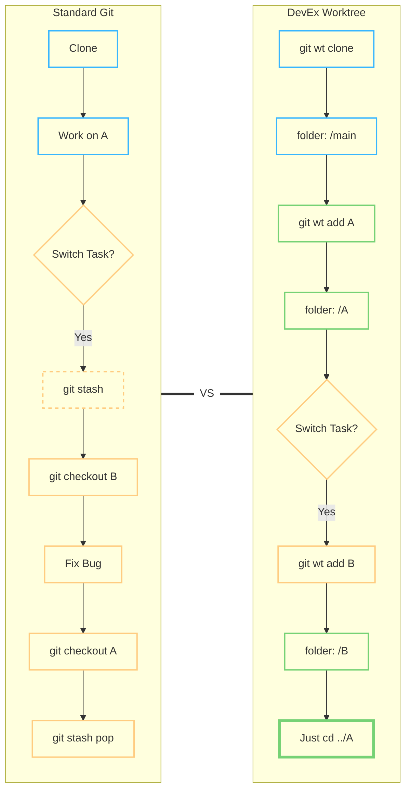
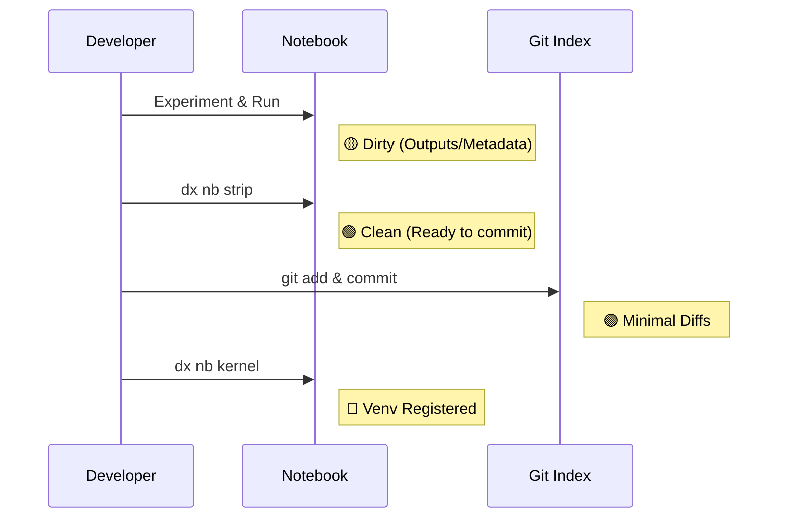
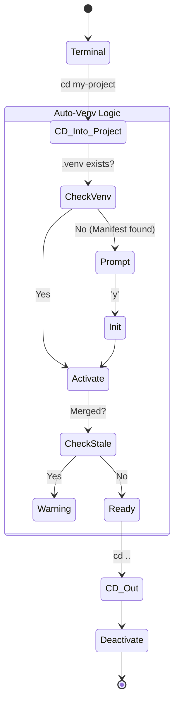

# DevEx Manager: Technical Workflows

## 1. git wt — Worktree Management



**Key Benefit:** Eliminates `git stash` and context switching. Each branch has its own directory and persistent IDE state.

---

## 2. dx nb — Notebook Utilities



**Key Benefit:** Keeps notebook history clean and ensures every worktree has its own dedicated Jupyter kernel.

---

## 3. Auto-Venv — Environment Automation



**Key Benefit:** Zero-touch virtual environment management and proactive warnings for merged worktrees.

---

## 4. git ctx — Developer Context Manager

```mermaid
graph TD
    A[git ctx show] --> B{Context file exists?}
    B -- "No" --> C[Initialize .git/info/devex/contexts/branch.md]
    B -- "Yes" --> D[Read & parse markdown checklist]
    C --> D
    D --> E[Print Checklist & Notes to terminal]
    
    F[git ctx done 1] --> G[Locate task in markdown file]
    G --> H[Replace [ ] with [x]]
    H --> E
    
    I[git ctx clean] --> J[Scan contexts folder]
    J --> K{Branch still exists?}
    K -- "No" --> L[List as Orphan]
    K -- "Yes" --> M[Skip]
    L --> N[Prompt to Delete]
    N -- "y" --> O[Remove context file]
```

**Key Benefit:** Keeps task-specific scratchpads and checklist items localized to each branch without polluting git commits or configuration.
